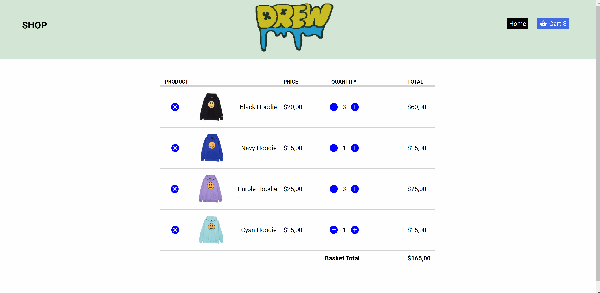
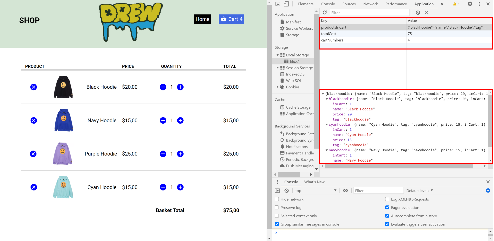

# JavaScript-Shopping-Cart-Feature
This shopping cart is solely built on Vanilla JavaScript using JSON format data. Items that are added into cart will be stored in local storage.

## Getting Started
1. Download the source code. 
2. Run [index.html](/JavaScript-Shopping-Cart-Feature/index.html).
3. Enjoy! 😃 

## Demos and Screenshot 

-----

  <h2>Add to Cart</h2>

-----

  <h2>Edit Quantity</h2>

-----

  <h2>Remove Item from Cart</h2>

-----

  <h2>Local Storage</h2>

-----

